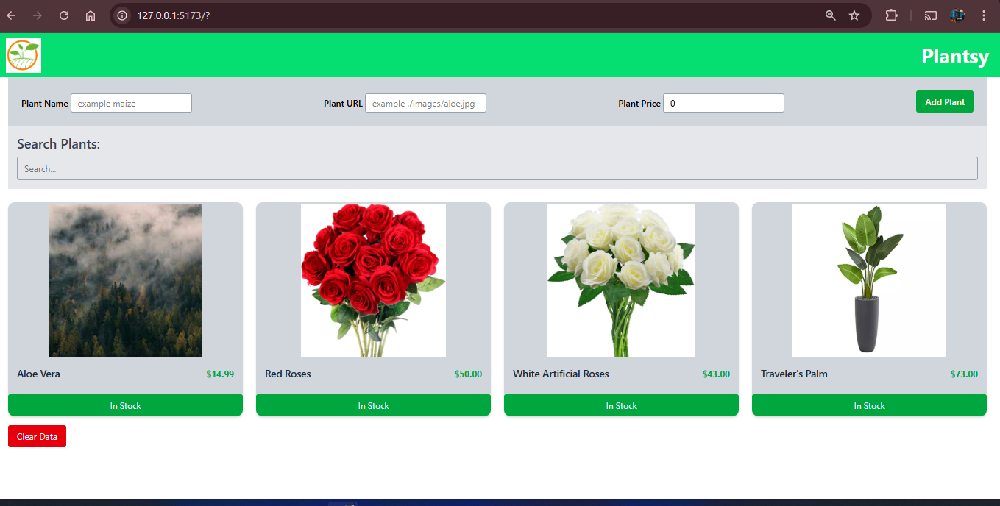

# Plantsy - A Plant Care and Catalog Application

Plantsy is a web application designed to help users browse, search, and manage their plant collection. The app allows users to add new plants, view their details, search for plants by name, and toggle their availability. It's a perfect tool for plant enthusiasts to keep track of their indoor garden and plant collection.

This application is built using **React**, **TypeScript**, and **Tailwind CSS** for styling. It leverages **localStorage** to persist data across sessions.
 
 ## screenshots
 

## Features

- **Plant Catalog**: View a collection of plants with details such as name, price, and image.
- **Search Functionality**: Easily search for plants by name using the search bar.
- **Add New Plant**: Add new plants to your catalog, including name, image, and price.
- **Stock Status**: Toggle plant availability (In Stock/Out of Stock).
- **Responsive Design**: Fully responsive layout, optimized for desktops, tablets, and mobile devices.
- **Persistent Data**: Plant data is stored in **localStorage**, ensuring it persists across sessions.

## Technologies Used

- **React**: A JavaScript library for building user interfaces.
- **TypeScript**: A statically typed superset of JavaScript that adds optional type-checking.
- **Tailwind CSS**: A utility-first CSS framework for fast and responsive design.
- **localStorage**: A simple storage solution to persist plant data across page reloads.

## Prerequisites

Before you can run this application locally, ensure you have the following tools installed on your computer:

- **Node.js**: The JavaScript runtime for executing your application.
- **npm**: The package manager to install dependencies.

## Installation

To set up this project locally, follow these steps:

1. Clone this repository:
   ```bash
   git clone https://github.com/yourusername/plantsy.git


## folder structure 
/plantsy
├── /public
│   └── index.html  # Main HTML file
├── /src
│   ├── /components
│   │   ├── PlantCard.tsx    # Displays individual plant details
│   │   ├── PlantForm.tsx    # Form to add new plants
│   │   └── SearchBar.tsx    # Search bar to filter plants
│   ├── /data
│   │   └── plants.json      # Sample plant data (optional, can be replaced with localStorage)
│   ├── /pages
│   │   └── Home.tsx         # Main page displaying plants
│   ├── App.tsx              # Main app component
│   └── index.tsx            # Entry point to the React app
├── /tailwind.config.js      # Tailwind CSS configuration
└── package.json             # Project metadata and dependencies


## Usage
## Adding a New Plant
 To add a new plant:

1. Fill in the Plant Name, Plant URL (image), and Plant Price in the form.

2. Click Add Plant to add the new plant to the catalog.

The new plant will appear on the homepage, and its data will be saved in localStorage for future sessions.

## Searching for Plants
You can search for plants by typing their name in the search bar. The plant list will automatically filter based on your input.

## Toggle Stock Status
Each plant has a button that allows you to toggle its availability. When a plant is in stock, the button will show "In Stock" with a green background. When it's out of stock, the button will show "Not in stock" with a red background.

## LocalStorage Behavior
When you refresh the page, the plant data will persist because it is saved to localStorage.

The data is updated whenever a new plant is added or when stock status is toggled.

If you remove plants from the JSON file (or the local data source), they will not appear unless the localStorage is cleared or updated with new data.

## Styling
Tailwind CSS is used for styling, providing a clean and responsive layout. Key styles include:

Hover Effects: Hovering over plant cards causes them to scale up slightly.

Responsive Grid Layout: Plant cards are arranged in a grid that adapts to different screen sizes.

Buttons: Action buttons for adding plants and toggling stock status are styled with Tailwind's utility classes.


Future Improvements
Delete Plant Feature: Add functionality to delete plants from the catalog.

Edit Plant Details: Allow users to edit plant details such as name, price, and image.

User Authentication: Implement user accounts and allow users to manage their own plant collection.

Advanced Search: Add more filtering options, such as price range or plant type.

Mobile Optimization: Further optimize for mobile users with smoother animations and more intuitive controls.

Contributing
We welcome contributions to improve the project! To contribute:

Fork the repository.

Create a new branch for your feature or bugfix.

Make your changes and ensure the code is well-tested.

Submit a pull request with a description of your changes.

License
This project is licensed under the MIT License. See the LICENSE file for more information.